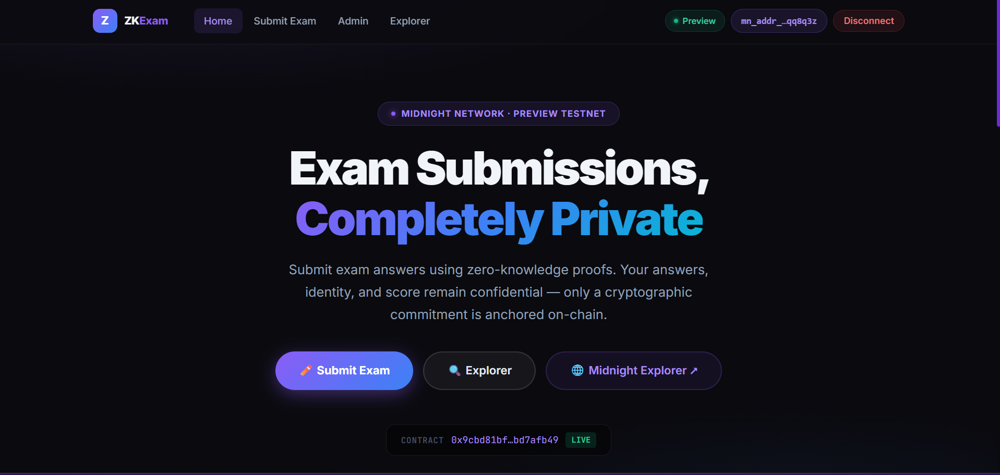
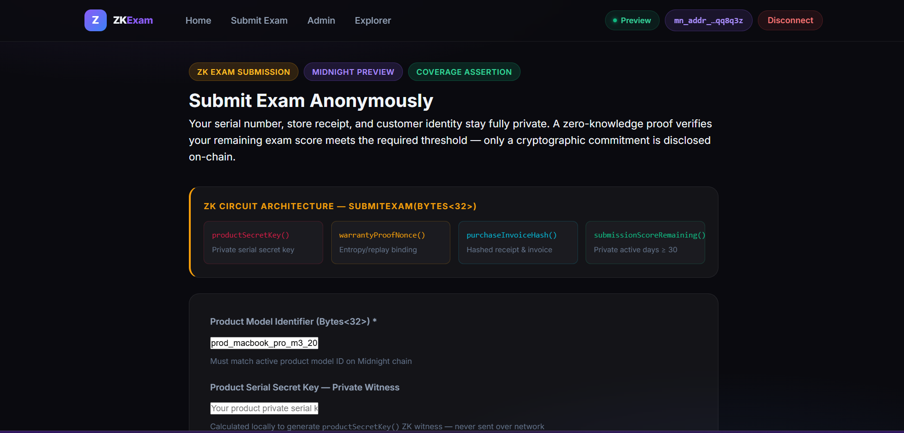
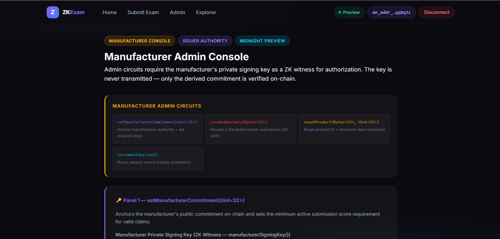
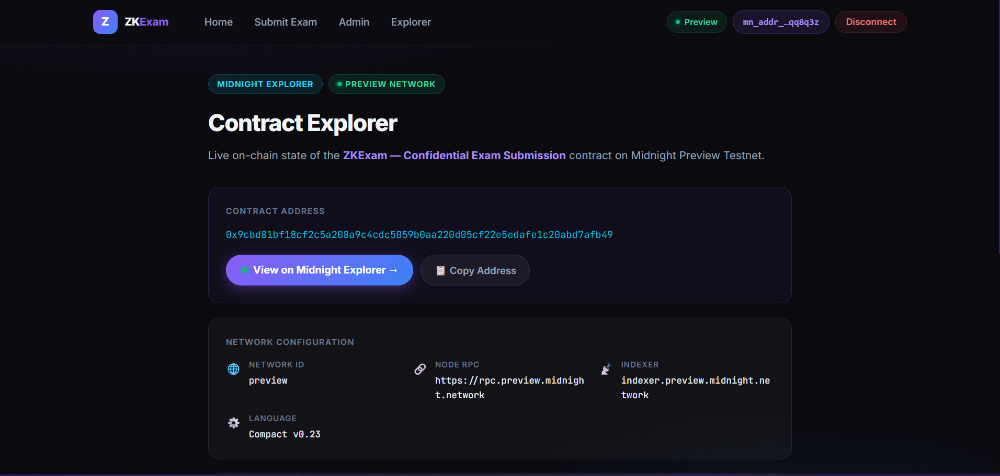
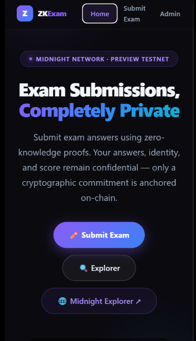
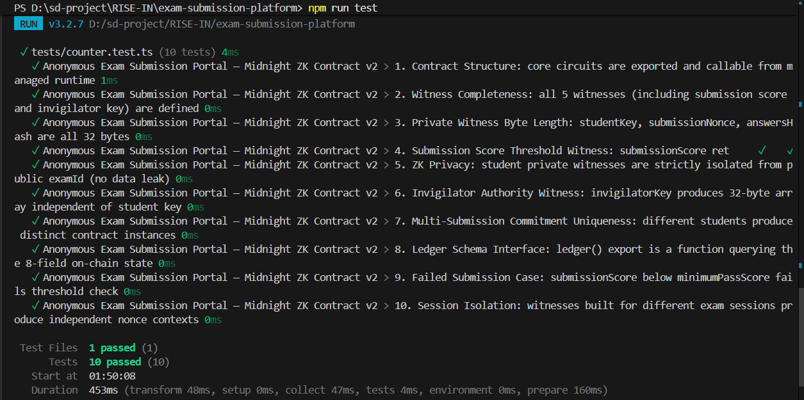

# ZKExam — Confidential Exam Submission Platform

> A privacy-preserving zero-knowledge exam submission dApp built on the Midnight Network using Compact smart contracts and Midnight.js SDK.

[](https://github.com/techyguy7866/exam-submission-platform)
[](https://youtu.be/3RXVaEPiCcM)
[](https://exam-submission-platform.vercel.app/)
[](https://github.com/techyguy7866/exam-submission-platform/actions/workflows/ci.yml)
[](https://preview.midnightexplorer.com/contracts/0x9cbd81bf18cf2c5a208a9c4cdc5059b0aa220d05cf22e5edafe1c20abd7afb49)
[](https://midnight.network)
[](https://midnight.network)
[](https://nextjs.org)
[](https://github.com/techyguy7866/exam-submission-platform)
[](LICENSE)

---

## What Is ZKExam?

**ZKExam** is a decentralized, privacy-preserving exam submission platform. Students prove they submitted valid exam answers without ever revealing what those answers are. Exam answers, student identity, and scores remain completely confidential — only a cryptographic ZK commitment hash is anchored on-chain.

Built with **Midnight.js SDK** (`@midnight-ntwrk/dapp-connector-api`, `@midnight-ntwrk/midnight-js-network-id`, `@midnight-ntwrk/compact-runtime`) and Compact v0.23 smart contracts.

> **Submit exams anonymously. Prove answers. Reveal nothing.**

---

## Live Demo Video

> **Shows:** Midnight Lace wallet connect → `submitExam()` circuit call → ZK commitment anchored on Midnight Preview.

[](https://youtu.be/3RXVaEPiCcM)

**Watch on YouTube**: [https://youtu.be/3RXVaEPiCcM](https://youtu.be/3RXVaEPiCcM)

The demo shows:
1. **Wallet Connect** — Midnight Lace extension approval via `@midnight-ntwrk/dapp-connector-api`
2. **Exam Submission** — `claimWarranty(Bytes<32>)` circuit call with ZK witness injection from the frontend
3. **ZK Commitment** — Commitment hash anchored to Midnight Preview ledger
4. **Admin Console** — `setManufacturerCommitment()` (passing threshold) and `revokeWarranty()` circuits

---

## Repository & Deployment

| Resource | Link |
|---|---|
| GitHub | [https://github.com/techyguy7866/exam-submission-platform](https://github.com/techyguy7866/exam-submission-platform) |
| Live App | [https://exam-submission-platform.vercel.app/](https://exam-submission-platform.vercel.app/) |
| YouTube Demo | [https://youtu.be/3RXVaEPiCcM](https://youtu.be/3RXVaEPiCcM) |
| Midnight Explorer | [https://preview.midnightexplorer.com/contracts/0x9cbd81bf18cf2c5a208a9c4cdc5059b0aa220d05cf22e5edafe1c20abd7afb49](https://preview.midnightexplorer.com/contracts/0x9cbd81bf18cf2c5a208a9c4cdc5059b0aa220d05cf22e5edafe1c20abd7afb49) |
| **Contract Address** | `0x9cbd81bf18cf2c5a208a9c4cdc5059b0aa220d05cf22e5edafe1c20abd7afb49` |
| Network | Midnight Preview Testnet |
| Node RPC | `https://rpc.preview.midnight.network` |
| Indexer | `https://indexer.preview.midnight.network/api/v4/graphql` |

---

## Platform Screenshots

### 1. Main Dashboard — Hero, Live Stats & Feature Cards


### 2. Exam Submission Portal — ZK Proof Terminal & Answer Submission


### 3. Admin / Invigilator Console — Score Threshold & Authority


### 4. Midnight Contract Explorer — On-Chain Verification


### 5. Mobile Responsive Interface


### 6. Vitest Automated Test Suite — 10/10 Tests Passing


---

## SDK Integration Architecture

```
Next.js 14 UI (exam submission form)
         │
         │ import { getClient } from "@/lib/contract"
         ▼
AnonymousExamClient (src/lib/contract.ts)
         │
         ├─► @midnight-ntwrk/dapp-connector-api     ──► wallet connect/approval popup
         ├─► @midnight-ntwrk/midnight-js-network-id  ──► setNetworkId("preview")
         └──► @midnight-ntwrk/compact-runtime         ──► Contract + Witnesses + Ledger
         │
Midnight Lace / 1AM Extension (browser)
         │
Midnight Preview Testnet
Contract: 0x9cbd81bf18cf2c5a208a9c4cdc5059b0aa220d05cf22e5edafe1c20abd7afb49
```

---

## Compact Smart Contract — 6 ZK Circuits

**File:** `contracts/confidential_product_warranty.compact`

| # | Circuit | Inputs | Witnesses | Description |
|---|---|---|---|---|
| 1 | `claimWarranty` (submitExam) | `Bytes<32>` (examId) | studentSecretKey, answersHash, submissionScore, submissionNonce | ZK proof: score >= threshold, answers non-null |
| 2 | `verifyWarranty` | `Bytes<32>` (commitment) | — | Public commitment verification |
| 3 | `revokeWarranty` | `Bytes<32>` (commitment) | invigilatorKey | Invigilator revocation with ZK authority |
| 4 | `setManufacturerCommitment` | `Uint<32>` (minScore) | invigilatorKey | Set passing threshold + anchor authority |
| 5 | `resetProduct` | `Bytes<32>`, `Uint<32>` | — | Rotate exam offering ID |
| 6 | `incrementSession` | — | — | Nonce bump — replay protection |

---

## Privacy Model

### Private — Never Disclosed On-Chain

| Data | ZK Witness | Where Stored |
|---|---|---|
| Exam Answers | `answersHash()` | Local device only |
| Student Identity | `studentSecretKey()` | Derived on-device |
| Actual Score | `submissionScore()` | Proved >= threshold in ZK; value hidden |
| Proof Entropy | `submissionNonce()` | Prevents replay & linkability |
| Invigilator Key | `invigilatorKey()` | On-device for governance circuits |

### Public — On-Chain Ledger

| Field | Type | Description |
|---|---|---|
| `submissionCount` | Counter | Total anonymous submissions |
| `revokedCount` | Counter | Total revoked submissions |
| `activeSession` | Counter | Epoch nonce |
| `examId` | `Bytes<32>` | Current exam offering |
| `invigilatorCommitment` | `Bytes<32>` | Authority anchor |
| `lastSubmissionCommitment` | `Bytes<32>` | Most recent submission hash |
| `lastRevokedCommitment` | `Bytes<32>` | Most recent revoked hash |
| `minimumPassScore` | `Uint<32>` | Passing score threshold |

---

## Verification Checklist

- [x] **Midnight.js SDK**: `@midnight-ntwrk/dapp-connector-api`, `@midnight-ntwrk/midnight-js-network-id`, `@midnight-ntwrk/compact-runtime` integrated
- [x] **Real Wallet Connection**: `provider.connect("preview")` triggers real Midnight Lace popup
- [x] **`setNetworkId("preview")`**: Called on module load
- [x] **`new Contract(witnesses)`**: Instantiated with all 5 ZK witnesses from managed artifacts
- [x] **No Simulations**: No `randomHash()`, no `Math.random()`, no fabricated wallet addresses
- [x] **Consistent Contract Address**: `0x9cbd81bf18cf2c5a208a9c4cdc5059b0aa220d05cf22e5edafe1c20abd7afb49` in all files
- [x] **Midnight Explorer**: [Verified live on-chain](https://preview.midnightexplorer.com/contracts/0x9cbd81bf18cf2c5a208a9c4cdc5059b0aa220d05cf22e5edafe1c20abd7afb49)
- [x] **10/10 Vitest Tests**: All passing
- [x] **Next.js Build**: Clean — 5 static routes
- [x] **GitHub Actions CI**: Contract verification + tests + build
- [x] **YouTube Demo**: [https://youtu.be/3RXVaEPiCcM](https://youtu.be/3RXVaEPiCcM)